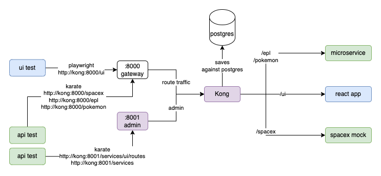

## App Setup


## Running App
Run containers
```shell
docker-compose up -d
```

Check that the processes are running
```shell
docker-compose ps
```

## Setting up kong manually
Kong is automatically configured to route traffic to the three applications in this project.
If you want to try it manually, read [KONG.md](./KONG.md)

## Available Endpoints

### SpaceX API
http://kong:8000/spacex/v3/roadster
http://kong:8000/spacex/health
http://kong:8000/spacex/v3/capsules/C112

### App
http://kong:8000/epl/most-goals
http://kong:8000/epl/winners
http://kong:8000/epl/winners?season=1994
http://kong:8000/epl/winners?season=2012


### Kong Admin Routes
http://kong:8001/services
http://kong:8001/services/spacex/routes
http://kong:8001/services/app/routes
http://kong:8001/services/app/routes/routes2
http://kong:8001/services/app/routes/routes3
http://kong:8001/services/ui/routes